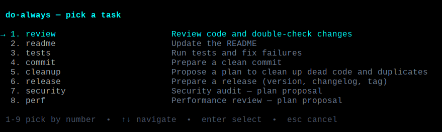

# pi-do-always

A [Pi](https://github.com/earendil-works/pi) extension that gives you a `/do-always` command for your
repeated "do the usual" prompts.

Type `/do-always` → a numbered list of tasks appears, grouped by category → press a number,
type to filter, scroll or click, or navigate with arrows + Enter → the task's prompt is
**filled into the input editor**. Review it, tweak it, press Enter to run. Tasks marked `⚡`
(the `Plan` category by default) auto-run on selection instead — see `autoRun` below.

```text
  do-always — pick a task

   #  TASK                      DESCRIPTION                                                    ORDER
  PLAN
   1  ⚡ Review changes         Review the current code changes (Plan)                           ·  
   2  ⚡ Review code            Review the whole project's code quality (Plan)                  [1] 
   3  ⚡ Cleanup                Clean up dead code and duplicates (Plan)                        [2] 
   4  ⚡ Security               Security audit (Plan)                                            ·  
   5  ⚡ Performance            Performance review (Plan)                                      ►[3] 
   6  ⚡ Propose features       Propose new features (Plan)                                      ·  
  DO
   7  Build                     Test build is ok and fix issues                                  ·  
   8  Tests                     Run tests and fix failures                                       ·  
  DOCS
   9  Readme                    Update the README.md                                             ·  

  ──────────────────────────────────────────────────────────────────────────────────────────────────
  Run the chain (3)
  ← tasks  •  ⏎ remove  •  esc  •  ctrl+u clear

  1-9 pick by number  •  type to filter  •  ↑↓ navigate  •  enter select  •  esc cancel  •  ⚡ auto-runs
```



## Usage

|Command|What it does|
|---|---|
|`/do-always` or the shortcut key (default `F4`)|Show the numbered task selector|
|`/do-always 2`|Fill the prompt for task #2 directly|
|`/do-always review changes`|Fill the prompt for the task named `review changes` (task names autocomplete after `/do-always`)|
|`/do-always list`|Print the task list|
|`/do-always list-details`|Show the full rendered prompt text each task will inject|

The selector supports direct number-pick (1-9), live type-to-filter, arrow/Enter navigation,
mouse-wheel scrolling, and click-to-select. While a filter is active, typed digits refine the
filter instead of picking by number; clear the filter (backspace) to use number-pick again.
Pause on a task for two seconds and its full prompt is previewed below the list, so you can
see exactly what will be injected before running it; moving the selection or typing hides it
and restarts the delay. A task marked `⚡` runs immediately on selection (its prompt is sent,
not filled): the `Plan` category does this by default, and any task can opt in or out via the
`autoRun` field.

In non-interactive modes (no TUI) there is no editor to fill, so the selected prompt is sent
as a user message instead.

## Chains

Run several tasks in a row as a **chain**. The selector shows an `ORDER` column; tasks in
the chain get a `[n]` marker in execution order, and a pinned row at the bottom of the
list runs the chain.

Building a chain in the selector:

- **Enter on a task row** runs just that task (the classic pick — the cursor starts in
  the task column).
- **→** moves the cursor to the ORDER column on the same row, where **Enter** toggles
  that task's chain membership (`·` → `[n]` → `·`). **←** goes back to the task column.
- **↑ / ↓** move the cursor in either column. The cursor is a **►** marker in the
  theme's accent color: in the left gutter in the task column, in the ORDER cell in
  the order column (plus a row highlight where your theme makes it visible). From the
  last task row, **↓** lands on the pinned Run row (and **↑** back).
- **Enter on the `Run the chain (n)` row** — or a mouse click on it — runs the chain.
  The row is dimmed while the chain is empty. The ► marker appears on it only
  while the cursor is on the row (as on task rows).
- **Backspace** (with no filter typed) undoes the last add; **ctrl+u** clears the whole
  chain; **Esc** cancels and discards it.
- Clicking an ORDER cell toggles the task's chain membership.
- The classic fast paths are unchanged: **1-9** runs a task immediately, and clicking a
  task row runs it — both close the selector and discard the chain.

Chains are capped at 8 tasks. Reordering is done by removing a task and re-adding it
(mouse drag reordering is planned for a future release). On narrow terminals the ORDER
column is dropped and the chain is shown on its own line below the list (keyboard
chaining still works).

Running a chain sends each step as its own turn, strictly one after another — the next
step starts only after the previous run has fully finished. Each step's guards are
re-evaluated at its turn against the current state; a step whose guards no longer hold
stops the chain there (with a warning), as do an aborted step (Esc) or a step that
errors. Steps already run are kept.

If the first task of a chain is a fill task (no `⚡`) in the TUI, step 1 is put in the
editor and the rest of the chain starts automatically once you press Enter and that run
finishes.

While a chain is running, a **status widget** is shown below the prompt: the chain's
tasks with a marker per step and a `(n/N)` progress count — the step the chain is
currently at.

```
  ⛓ do-always (2/4)
  ✓ Review changes
  ▶ Build
  ○ Test
  ○ Deploy
```

Markers: `✓` completed, `▶` running (or waiting for your Enter on a fill-first step 1),
`○` pending, `✗` errored / failed to start, `⊘` aborted, `–` skipped because its guards
no longer hold. The widget is removed when the chain completes (unless a report file was
written — see below); if the chain stops early it stays below the prompt as a trace of
where it stopped (until the next chain or a new session). Starting a second chain while
one is running is refused — wait for it to finish or abort the current step with Esc.

Every chain run also writes a **report file** in the project root —
`do-always-report-tasks-YYYY-MM-DD-HHMM.md` (e.g. `do-always-report-tasks-2025-01-15-1432.md`) —
so earlier steps' results are not lost when later steps' output scrolls them off screen.
Each step appends a section as it finishes (the step's final assistant message, with its
outcome and run time), so the file is complete even if the session dies mid-chain; a
footer with the overall summary is appended when the chain ends. When a report was
written, the completion widget stays below the prompt pointing at the file, and the
completion notification carries its path. Set `"report": false` in the config to disable
it (the project file's value wins over the global one).

## Install

Install it from npm as a Pi package, which loads the bundled `index.ts` (and its `tasks.ts`) without
managing symlinks:

```bash
pi install npm:pi-do-always
```

Manage it with `pi list` (to see installed sources) and `pi remove <source>` using the same
source you installed with (e.g. `pi remove npm:pi-do-always`).

Alternatively, you can install from the git repo or symlink a local checkout for development:

```bash
ln -s "$PWD" ~/.pi/agent/extensions/do-always   # uninstall with: rm that symlink
```

For development you can also load it explicitly: `npm run dev` (runs `pi --extension ./extensions/pi-do-always/index.ts`).

## Tasks configuration

Tasks are read from JSON files (an array of tasks, or the object form `{"tasks": [...], "shortcut": "f4"}`):

|File|Scope|
|---|---|
|`~/.pi/agent/do-always.json`|Global (all projects)|
|`<project>/.pi/do-always.json`|Project-local; overrides global tasks with the same `name`|

If neither file exists, the built-in defaults (Review changes, Review code, Cleanup, Security, Performance, Propose features, Build, Tests, Readme, Release, Commit) are used.
This repo ships a sample in [`do-always.json`](./extensions/pi-do-always/do-always.json) — copy it to one of the
locations above to make it your own:

```json
[
  {
    "name": "review",
    "category": "Plan",
    "description": "Review code and double-check changes",
    "prompt": "Review the changes on branch {{branch}} ({{files_changed_count}} changed files: {{files_changed}}). Last commit: {{last_commit}}. Check `git status` and `git diff` ..."
  }
]
```

Fields:

- `name` (required) — short unique id, used for `/do-always <name>`
- `category` (optional) — group header the task is shown under in the selector (e.g. `"Plan"`, `"Do"`). Matching is case-insensitive and the header is title-cased, so `"plan"` and `"Plan"` land in the same `Plan` group. Tasks without a category fall under `Other`. The built-in defaults are grouped into `Plan`, `Do`, `Docs`, and `Ops`.
- `description` (optional) — one-line label shown in the selector
- `prompt` (required) — the text filled into the editor (supports `{{placeholders}}` — see [Prompt placeholders](#prompt-placeholders))
- `autoRun` (optional) — when `true`, selecting the task sends its prompt immediately instead of filling the editor; when `false`, it always fills the editor. When omitted, the default is derived from the category: `Plan` tasks auto-run, everything else fills the editor. Auto-run tasks are marked `⚡` in the selector.
- `when` (optional) — a condition that hides the task from the selector and lists when it is not met (see [Conditionals](#conditionals)).
- `guards` (optional) — an array of selection-time guards that block the task (with a message, not a hide) when a condition is unmet (see [Guards](#guards)). The legacy `requireDirty` (boolean) still works and is combined with any `guards`.

In the object form you can also configure the selector shortcut:

- `shortcut` (optional) — key that opens the selector, e.g. `"f4"`. Set to `null` to disable the shortcut. Defaults to `F4`. The project file's value wins over the global one.
- `merge` (optional) — how project tasks combine with the global tasks: `"override"` (default) replaces a global task with the same `name`; `"append"` keeps the global tasks and only adds new project task names (a cascade, like CSS). The project file's value wins over the global one; when neither sets it, the default is `override` (the historical behavior).
- `report` (optional) — whether chain runs write a Markdown report file in the project root (one per run, appended as each step finishes). Default `true`; set `false` to disable. The project file's value wins over the global one. See [Chains](#chains).

Example project file that only *adds* tasks without overriding the global set:

```json
{
  "merge": "append",
  "tasks": [
    { "name": "deploy", "category": "Ops", "prompt": "Deploy this project to staging." }
  ]
}
```

Reload Pi (or start a new session) after editing a config file.

## Prompt placeholders

Task prompts support `{{placeholders}}` that are filled in from the current
directory when a task is selected — so `/do-always review changes` on a hotfix branch
injects “Review the changes on branch `fix/login-null` (3 changed files:
`auth.ts`, `login.ts`, `test/auth.test.ts`) …” instead of a generic nudge.

|Placeholder|Value|
|---|---|
|`{{cwd}}`|Absolute path of the working directory|
|`{{date}}`|Local date (`YYYY-MM-DD`)|
|`{{branch}}`|Current git branch (`unknown` outside a git repo)|
|`{{last_commit}}`|Subject of the latest commit (`unknown` if unavailable, e.g. empty repo)|
|`{{files_changed}}`|Changed files from `git status` — comma-separated, capped at 20 entries (`none` when clean or not a git repo)|
|`{{files_changed_count}}`|Number of changed files (`0` when clean or not a git repo)|
|`{{user}}`|`git config user.name` (`unknown` when unset)|
|`{{diff_stat}}`|`git diff --shortstat` output, e.g. `3 files changed, 41 insertions(+), 7 deletions(-)` (`none` when unavailable)|
|`{{repo}}`|Basename of the git remote (or of the working directory when there is no remote) — disambiguates monorepo work|
|`{{staged_files}}`|Files staged for commit, one per line (`none` when empty)|
|`{{unstaged_files}}`|Modified-but-unstaged files, one per line (`none` when empty)|

Unknown placeholders are left as-is, and a prompt without placeholders is
injected unchanged, so existing configs keep working. The selector preview and
`/do-always list-details` show the rendered prompt — what you see is what gets
injected.

## Conditionals

A task's `when` field controls whether it is shown in the selector and in
`/do-always list` / `list-details`. When the condition is not met the task is
hidden everywhere (including when picked by number or name), so it can never
be selected into a no-op. Omitting `when` always shows the task.

The string form is a single condition:

- `"git"` — shown only inside a git working tree.
- `"!git"` — shown only outside a git working tree.

The object form is a set of conditions that must **all** hold (logical AND):

| Key | Meaning |
|---|---|
| `"git": boolean` | `true` inside a git repo, `false` outside |
| `"branch": string` | current branch equals the given name (exact match) |
| `"file": string` | path exists (file or directory) relative to the working tree |
| `"repo": string` | equals the git-remote basename context value |

```json
[
  { "name": "review", "category": "Plan", "prompt": "Review the changes…", "when": "git" },
  { "name": "deploy-staging", "category": "Ops", "prompt": "Deploy to staging.", "when": { "branch": "main" } },
  { "name": "lint-js", "category": "Do", "prompt": "Lint the JavaScript.", "when": { "file": "package.json" } }
]
```

An invalid `when` (wrong type, unknown key) is ignored with a warning and the
task is shown, so a typo never silently hides a task. Reload Pi (or start a new
session) after editing a config file.

## Guards

Guards keep low-value round-trips down: the task stays visible, but selecting it
notifies with the reason instead of injecting a no-op prompt. Guards are
evaluated against the current prompt context, so a task is only injected when
**every** guard is met. `requireDirty` (boolean, the historical guard) is
combined with any `guards` array.

The `guards` array accepts these guard objects (all must pass):

| `type` | `value` | Blocks when… |
|---|---|---|
| `requireDirty` | none | the working tree is clean (no changed files) |
| `requireBranch` | branch name | the current branch is not the given name |
| `requireRepo` | repo name | the git-remote basename context value is not the given name |
| `requireFilePattern` | glob | no changed file matches the glob |

For `requireFilePattern`, `*` matches within a path segment, `**` crosses
segments, `?` matches one non-separator character, and other regex
metacharacters are literal.

```json
[
  { "name": "deploy-staging", "category": "Ops", "prompt": "Deploy to staging.", "guards": [ { "type": "requireBranch", "value": "main" } ] },
  { "name": "lint-tests", "category": "Do", "prompt": "Run the test suite.", "guards": [ { "type": "requireFilePattern", "value": "**/*.test.ts" } ] }
]
```

An invalid guard (unknown `type`, missing `value`, or a non-array `guards`)
is ignored with a warning, so a typo never silently disables a guard. Reload Pi
(or start a new session) after editing a config file.

## Development

```bash
npm install        # dev dependencies (pi packages + typescript)
npm run typecheck  # tsc --noEmit
npm test           # run the unit tests (node:test + tsx, in test/)
```

The pure task logic (`parseConfig`, `mergeTasks`, `renderPrompt`, `resolveTask`, `formatList`) lives in
[`tasks.ts`](./extensions/pi-do-always/tasks.ts) with no Pi dependencies, so it is unit-tested independently of the
Pi runtime. The extension (`extensions/pi-do-always/index.ts`) imports that logic and adds only the Pi UI.
